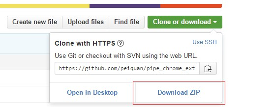
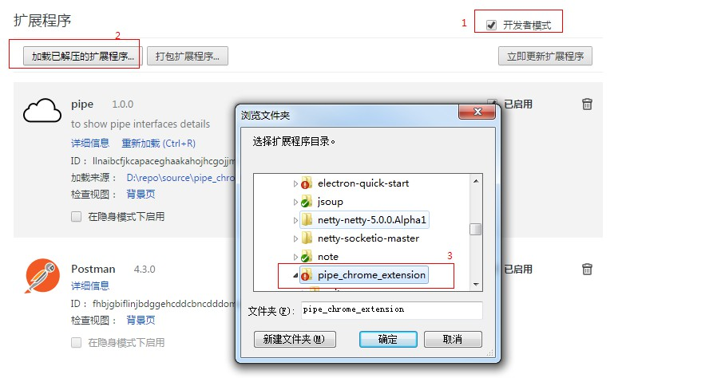

# pipe_chrome_extension
通渠王使用的 chrome 插件，用来展示各个接口的性能，方便定位页面请求慢的问题。因为没有发布到 chrome web store，只能暂时以开发者的模式进行本地安装。

## 安装方法
- 第一步

	从 [github](https://github.com/peiquan/pipe_chrome_extension) 上下对应的 zip 文件 

	

	接着解压

- 第二步

	打开的 chrome 的扩展程序，操作如下:	

	

## 效果图

- 控制面板
	
	

	插件是否启动: 控制整个插件的使用。

- 页面展示图

	

	左上角是请求的唯一标识码，右上角是请求服务器的 ip 的地址。其余各行为后端请求的性能。